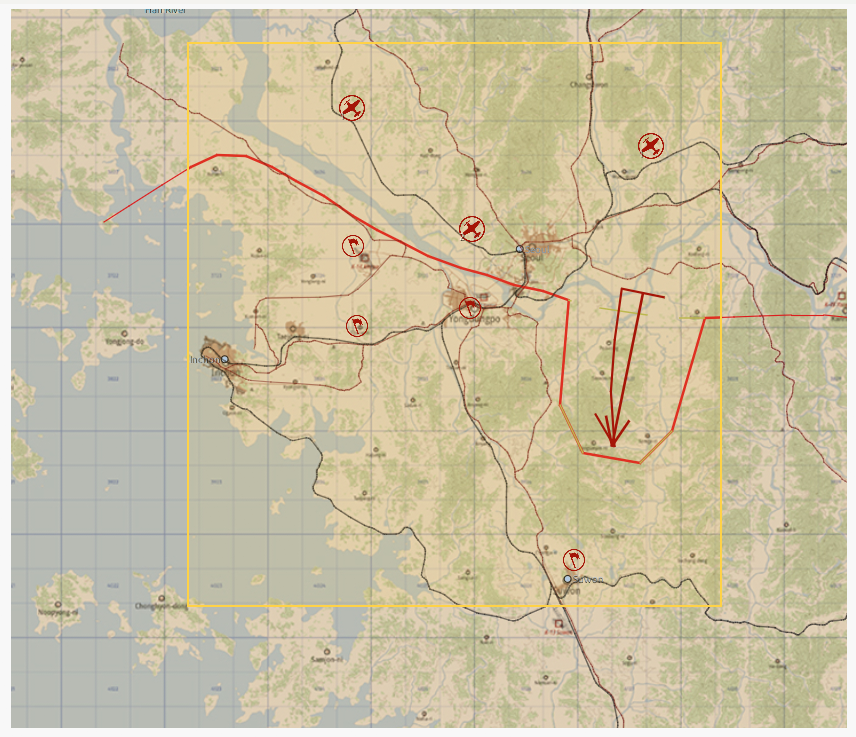
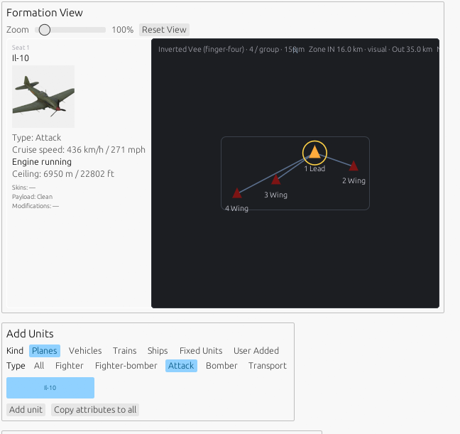

IL-2 Mission Utility — how it works

What it is: a program that is designed to help with IL-2 .Group files and mission editing.  This is a utility designed to be used with the mission editor.  The utility allows for simple creating of template unit groups or simple creation of fighter "packs" based on checkzone MCUs.  It also features a map mode which can help with quickly establishing a usable map.  Yuo still have to use the editor, this app is just designed to take a lot of the tedious work out of setting things up.

Right now there are 6 tabs. Each one does one job:
1. Fighter Pack — airplane spawners

    Pick your planes (from the Korea fighters), how many flights, skill levels, and which side (USSR / DPRK / PRC / USA).
    Hit Generate. The tool copies the group as many times as you need and parks them on the map in a tidy grid (or at spots you choose).
    The copies are wired so they take turns spawning instead of all dumping their air at once.
    Export → one .Group file. Drop it into your mission, move the groups to where you would like them and their RTB waypoint, done.

2. Exclusive Activation — several plans, only one fires

    Load any group that has checkzone trigger plans (e.g. three different bomber attack routes that have been pre-designed in the mission editor).
    The tool copies each plan onto the map and links them together so only one can trigger at a time.
    Export → one file containing all the plans, but just one will activate based on the checkzone mcu.
    For best results in making your group compliant, use the template mode as a starting point.

3. Army Generator — tanks, guns, trucks, trains, ships

    Pick your predefined ground unit templates (armor, ships, artillery, supply, trains).
    Set how many copies of each and what % chance each type shows up or choose to use all of them.
    Generate → the copies are parked on the map in a group and the randomizer decides which ones actually spawn at the time of mission load.

4. Map — full scenario base map helper

    Pick a date from the Korea timeline (e.g. mid-July 1950).
    Pick your area of operations on the map.
    Use the Map Tools to draw a front line on the map (must be done from left to right), define salients, and place arrows.
    This automatically defines areas of influence and a front line onto the map.
    Load fighters as defined in the fighter section automatically (not need to import the group)
    Define areas of interest with objective markers for importing ground units near targets.
    Load saved ground unit groups or place in directly what is setup in the Army Generator.
    Trains and single column convoys will automatically snap to road and railways. 
    Ground groups automatically place near the front line and units with an attackarea mcu (with attack ground selected) will point towards objectives
    Ships will automatically be placed in the water. 
    Drag units markers and waypoints around to your liking.
    Load reference groups to import scenery blocks or specific airbases.  The AO box will automatically clip out the areas not in the zone with a 10km buffer. 
    Export → a base-map .group file with a defined front and reference units. Drop the group into the editor and build your mission on top of it.

   

6. Template Builder — make your own unit group assign it orders

    Pick a unit type (plane / tank / train / ship) and set it up: seats, orders, waypoints, trigger distance.
    It generates one self-contained group: when units get close it triggers, spawns them, sends them on their orders, and cleans up after itself on zone out.
    Note: This mode doesn't place the group on the map for you — import it in the mission editor (or feed it into one of the other modes).
    Export → one template .Group you can reuse as you see fit.

This mode was initially designed to take the work out of creating the flip-flop check zone logic, but it has evolved into a fairly nice way to assign orders in a logical tree like format.  (for example, formation -> waypoint -> attack -> mission complete).

 

6. Airfield — make a single-player airfield multiplayer-ready

    Load an SP airfield group (for example, export the airfield of choice from the _gen.mission file from the task editor mode).
    A summary shows what was found and removed (the player plane and all the single-player-only stuff, and fixes the coalition settings).
    Export → a clean airfield, ready for MP missions. Position stays exactly where it was ready to be used in the map mode.
    You will need to set the location and plane type in the mission editor, but the difficult work of removing the unneeded clutter is done for you.

Which tab do I actually want?

- Airplane spawners → Fighter Pack
- Several plans, want only one to fire → Exclusive
- Tanks, guns, trains → Army Generator
- Full map with a dated front line → Map
- Building a brand-new unit group → Template Builder
- Converting an SP airfield → Airfield

Todo: 
- Update the user manual to human readable text (not AI babble) to provide a clear understanding of how this utility is supposed to work.
- Provide for localization

How to build:
- Download & install [Rust](https://rust-lang.org/)
- Click the green <>Code button and download the zip from this github page
- Unzip the downloaded source code into a known folder location, ie: C:\IL2MissionUtil
- open the source code folder in a terminal
- enter *cargo build --release* into the terminal to build the exe
- double click the newly built *Il2MissionUtility.exe* file now found in the /target/release folder to run the app.

Source code updated on 09/04/2026

Added [MapHelper](MapHelper/maphelper.md) - a fast, lightweight desktop utility designed for IL-2 Sturmovik: Great Battles mission mapping and map management. Built in Rust and powered by the `egui` framework, it provides an efficient and responsive interface for handling map data and mission files.
This utility is designed to provide a data set for the Mission Utility to use when placing units either on land or at sea.
